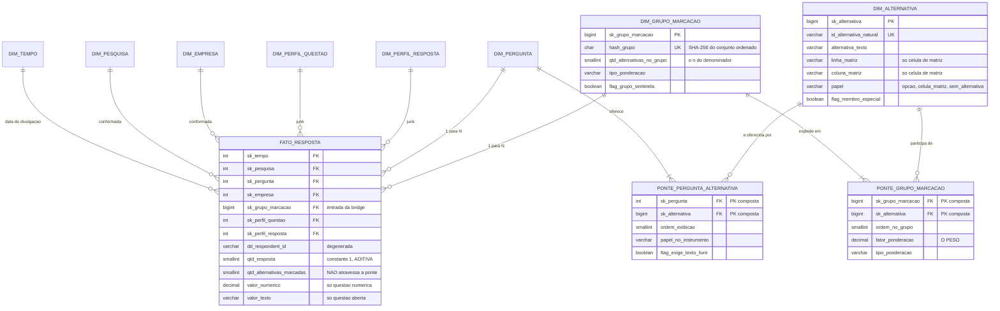
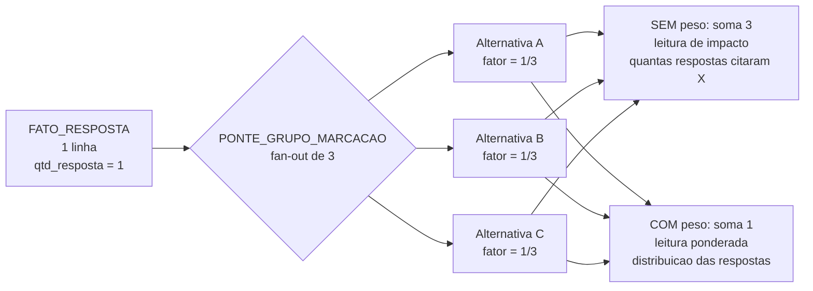
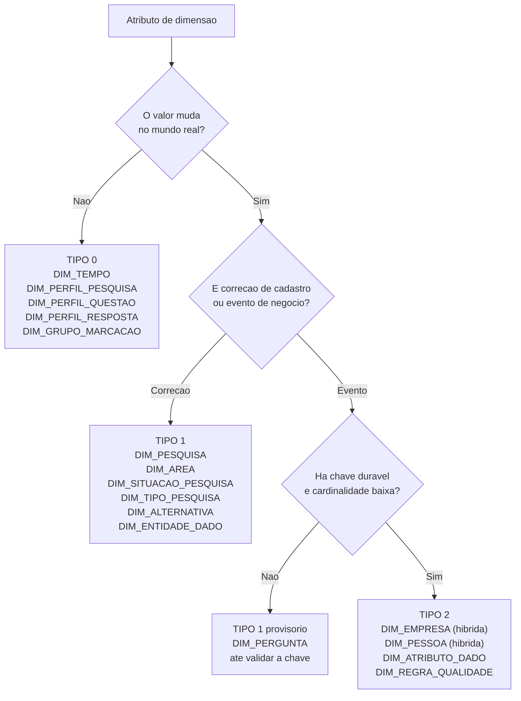

# Dimensões Especiais: Bridge Table, Junk Dimensions e SCD

Complemento às subseções em branco do Data Model Canvas (`dmc.md` e `dmc.json`). A **Seção 1** registra o cubo escolhido e a evidência da relação N:N. A **Seção 2** modela a bridge table, com colunas, chaves e o fator de ponderação. A **Seção 3** propõe as junk dimensions. A **Seção 4** escolhe o SCD de cada dimensão. A **Seção 5** mapeia o impacto no canvas e o que falta apurar. Todos os números vêm de `docs/dados/`, apurados na Sprint 1.

---

## 1. Cubo escolhido e a relação N:N

O cubo é o **Cubo 3, Resultado da Pesquisa**, o único dos quatro que sustenta os três conceitos sem forçar nenhum deles. Nos demais, a cardinalidade foi testada e não há N:N: em `pesquisas`, as frequências de `area` somam exatamente 366 e as de `tipo` também, o que prova valor único por linha; pessoa e empresa é 1:N, como o canvas já registrou; e as dimensões do Cubo 4 são metadado hierárquico.

No Cubo 3 há dois N:N, em níveis diferentes:

| Nível | Relação | Evidência apurada |
|---|---|---|
| Instrumento | Pergunta e Alternativa | `questoes.alternativas` é multivalorado com separador ` \| `. A lista `"Não \| Sim"` aparece em **31 das 231 questões (13,4%)**, e `"Presidente"` aparece **992 vezes** em perguntas diferentes |
| Fato | Resposta e Alternativas marcadas | **80 questões (34,6%) são `caixas_de_selecao`**. O par respondente mais pergunta identifica **9.543 combinações para 20.607 linhas**, fator de 2,16 |

| Tipo de questão | Qtd | % | Marcações por resposta |
|---|---|---|---|
| `multipla_escolha` | 123 | 53,2 | exatamente 1 |
| `caixas_de_selecao` | 80 | 34,6 | **1 a N** |
| `numerica` / `aberta` | 25 | 10,8 | nenhuma, valor livre |
| `matriz_avaliacao` | 3 | 1,3 | **1 a 96 células** |

---

## 2. Bridge Table

### 2.1 Esquema

O grão do fato **sobe** de uma linha por marcação (20.607) para **uma linha por respondente e pergunta (9.543)**. É essa elevação que devolve aditividade a `qtd_resposta`, que hoje não a tem: a bridge corrige um defeito que o canvas já registrou como erro de 2,2 vezes.

`DIM_ALTERNATIVA` recebe três membros especiais para que nenhuma FK fique nula: `(-1) Não respondida`, `(-2) Resposta de valor livre` e `(-3) Alternativa não catalogada`. Nas questões de matriz, o membro é a **célula**, não a linha ou a coluna isoladas.

### 2.2 O peso

| Tipo de questão | `tipo_ponderacao` | `fator_ponderacao` | Soma do grupo |
|---|---|---|---|
| `multipla_escolha` (123) | `exclusiva` | **1** | 1 |
| `caixas_de_selecao` (80) | `compartilhada` | **1 / n** | 1 |
| `matriz_avaliacao` (3) | `independente` | **1** | n |
| `numerica`, `aberta`, não respondida (25) | `sentinela` | **1** | 1 |

A matriz é o único caso em que o grupo não fecha em 1, e isso é correto: cada célula é um julgamento binário independente (o nível X recebe o item Y), não uma fatia de escolha única. O denominador de um percentual de matriz é respondentes vezes linhas, e precisa ficar declarado no painel.

**Comportamento de cada métrica ao atravessar a ponte:**

| Métrica | Sem peso | Com peso |
|---|---|---|
| `qtd_resposta` | **citações**, soma maior que o total. Correto para "quantas respostas citaram esta alternativa" | **aditiva e exata**. `SUM(qtd_resposta * fator_ponderacao)` devolve o total |
| `qtd_alternativas_marcadas` | **proibido**, vira n ao quadrado | não recupera. Não atravessa |
| `qtd_respondentes_distintos`, `qtd_empresas_respondentes` | **seguro**, `COUNT DISTINCT` é imune ao fan-out | idem |
| `pct_escolha_da_alternativa` | numerador é a citação sem peso, denominador é o número de respondentes da questão | não se aplica |
| `valor_numerico` | **seguro**, grupo sentinela tem um membro e o fan-out é 1 | idem |

A proibição sobre `qtd_alternativas_marcadas` merece o número: a maior questão de matriz tem `qtd_alternativas = 96`. Somada através da ponte, uma única resposta devolveria **9.216 em vez de 96**.

**Restrição de carga:** para todo grupo, `COUNT(*)` na ponte deve igualar `qtd_alternativas_no_grupo`, e nos grupos `compartilhada` a `SUM(fator_ponderacao)` deve ser 1 dentro da tolerância de arredondamento.

### 2.3 A ponte de catálogo

`PONTE_PERGUNTA_ALTERNATIVA` resolve o N:N do instrumento e existe por uma razão específica: sem ela é impossível saber quais alternativas foram **oferecidas e nunca escolhidas**, porque o fato só conhece o que foi marcado.

**Ela não carrega peso, porque nenhuma métrica aditiva deve atravessá-la.** É catálogo, não agregação. Somar `qtd_resposta` por ela replicaria cada resposta pelo número de alternativas **oferecidas**, e não pelo número **marcado**. Se uma consulta futura precisar mesmo agregar por este caminho, o peso é `1 / qtd_alternativas_oferecidas`, materializado antes do uso.

### 2.4 Volumetria estimada

| Tabela | Linhas | Origem do número |
|---|---|---|
| `FATO_RESPOSTA` | **9.543** | pares distintos respondente mais pergunta, apurado |
| `PONTE_GRUPO_MARCACAO` | até **20.607** | uma linha por marcação, antes de deduplicar grupos |
| `DIM_GRUPO_MARCACAO` | até 9.543, esperado bem menos | a apurar |
| `PONTE_PERGUNTA_ALTERNATIVA` | cerca de **1.159** | 206 questões vezes média de 5,63 alternativas |
| `DIM_ALTERNATIVA` | ao menos 246 | textos distintos observados mais células de matriz |

A ponte é pequena em qualquer cenário. Não há argumento de desempenho contra ela, o que reforça que a decisão é de correção e não de custo.

---

## 3. Junk Dimensions

Um atributo entra em junk quando tem **baixa cardinalidade**, **não tem casa natural** (ou custa caro mantê-lo nela) e **não tem hierarquia própria**. Confundir "poucos valores" com "sem lugar" é o erro clássico.

**`DIM_PERFIL_QUESTAO`** (FK no fato): `tipo_questao` (5 valores), `nivel_confianca_extracao` (`alta` 97,8%, `media` 2,2%), `formato_arquivo_origem` (`new` 62,8%, `old` 37,2%), `faixa_qtd_alternativas` (5 faixas) e `flag_admite_multipla_marcacao` (separa as 83 questões que geram fan-out). Cartesiano de 200, mas construída **a partir das combinações observadas**, o que deve ficar abaixo de trinta linhas.

O motivo forte de tirar esses atributos de `DIM_PERGUNTA` não é estético: **`DIM_PERGUNTA` será Tipo 2**, e metadado de extração não deveria versionar a cada reformulação de enunciado. Junk e SCD se resolvem na mesma decisão.

**`DIM_PERFIL_RESPOSTA`** (FK no fato): `flag_resposta_de_matriz` (4.004 linhas, 19,4%), `flag_multipla_marcacao`, `flag_com_valor_livre` (12.290, 59,6%), `flag_sem_marcacao` (10.266, 49,8%) e `flag_empresa_identificada` (10 linhas sem chave). Máximo de 32 linhas, provavelmente menos de 15 reais.

**Candidatos recusados:**

| Candidato | Motivo |
|---|---|
| `Nacionalidade`, `Associado`, `Tipo de Associado` | descrevem a empresa, e `DIM_EMPRESA` já existe |
| `dia da semana de lançamento` | derivado da data, pertence a `DIM_TEMPO`. Duplicá-lo criaria dois caminhos |
| `flag_pesquisa_no_cadastro` | é da pesquisa, não da resposta. Vira atributo de `DIM_PESQUISA`, com os 4 identificadores órfãos resolvidos por membro especial |
| Junk no Cubo 4 | as três dimensões de metadado já são o conteúdo do cubo, não sobra atributo órfão |

---

## 4. SCD por dimensão

Híbrida quer dizer Tipo 2 nos atributos de negócio e Tipo 1 nos de correção de cadastro, na mesma dimensão.

| # | Dimensão | Cubos | SCD | Versiona | Justificativa |
|---|---|---|---|---|---|
| 1 | DIM_TEMPO | 1,2,3,4 | **0** | nada | calendário é imutável, linhas geradas e não carregadas |
| 2 | DIM_PESQUISA | 1,2,3 | **1** | título, objetivos | a pesquisa é evento delimitado. Correção de título é correção, não história |
| 3 | DIM_AREA | 1 | **1** | nome | renomeação deve propagar para manter contínua a série de PN02. Reorganização de escopo exige código novo, não versão |
| 4 | DIM_SITUACAO_PESQUISA | 1 | **1** | rótulo | domínio estático de 7 valores. O que muda é a FK, e a origem não guarda transições |
| 5 | DIM_TIPO_PESQUISA | 1 | **1** | rótulo | domínio estático de 8 valores |
| 6 | DIM_PERFIL_PESQUISA (junk) | 1 | **0** | nada | junk nunca versiona. Combinação nova é linha nova |
| 7 | **DIM_EMPRESA** | 2,3 | **2 híbrido** | `Associado`, `Tipo de Associado`, `Nacionalidade`. Tipo 1 em `Nome Fantasia`, `Cidade`, `Estado`, `País` | mudança de status associativo é evento real e altera PN08 e PN11. Os demais são correção de cadastro |
| 8 | **DIM_PESSOA** | 2 | **2 híbrido** | `cargo`, `departamento`. Tipo 1 em `e-mail` | 49 cargos e 78 departamentos. Promoção e transferência são reais, e é a limitação assumida na Seção 4.6 do canvas |
| 9 | **DIM_PERGUNTA** | 3 | **2**, condicionado | `enunciado` | 84 pesquisas fixas anuais (23,0%) e 4 bianuais. O instrumento se repete entre edições. Depende da chave durável, ver 4.2 |
| 10 | DIM_ALTERNATIVA | 3 | **1** | texto | correção de grafia não merece versão. Há 15 variantes excedentes em `respostas.valor`. Mudança de sentido é membro novo |
| 11 | DIM_GRUPO_MARCACAO | 3 | **0** | nada | o grupo **é** o conjunto. Conjunto diferente é grupo diferente |
| 12 | DIM_PERFIL_QUESTAO (junk) | 3 | **0** | nada | junk nunca versiona |
| 13 | DIM_PERFIL_RESPOSTA (junk) | 3 | **0** | nada | junk nunca versiona |
| 14 | DIM_ENTIDADE_DADO | 4 | **1** | nome | metadado descritivo, sem valor histórico |
| 15 | DIM_ATRIBUTO_DADO | 4 | **2** | classificação, criticidade | o histórico precisa dizer contra qual definição a medição foi feita |
| 16 | **DIM_REGRA_QUALIDADE** | 4 | **2** | `peso`, limiar | `score_saude_dado` é média ponderada. Alterar o peso sob Tipo 1 reescreve a série e a torna irreproduzível |

Resumo: Tipo 0 em 5, Tipo 1 em 6, Tipo 2 em 5, das quais duas em modo híbrido.

### 4.1 Regras de carga

**Normalizar antes de versionar.** O tratamento Tipo 1 de domínio roda **antes** da comparação que dispara o Tipo 2. Sem essa ordem, correção de grafia vira versão histórica falsa. O volume está apurado: `Associado` 1 variante excedente, `Cidade` 2, `País` 2, `cargo` 1, `departamento` 5, `respostas.valor` 15.

**Colunas de controle no Tipo 2:** `sk_<dim>`, `id_<dim>_duravel`, `dt_inicio_vigencia`, `dt_fim_vigencia`, `flag_versao_corrente`, `num_versao`.

**A série começa na implantação.** Nenhuma base traz data de vigência, como a Seção 4.6 do canvas registra. A versão 1 nasce na primeira carga e o histórico só existe daí em diante. O painel deve exibir a data de início da série.

**Ausência não é mudança.** `Associado` tem 78,7% de completude e `Tipo de Associado` 93,7%. Transição de preenchido para vazio é falha de carga, não versão nova, senão a dimensão registra "deixou de ser associado" a cada carga incompleta.